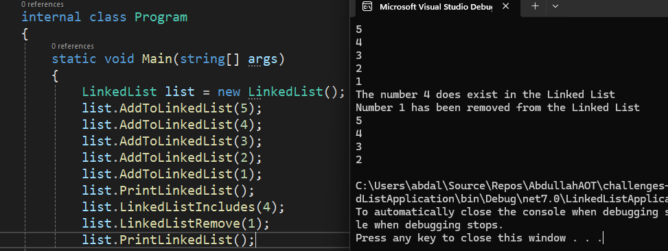
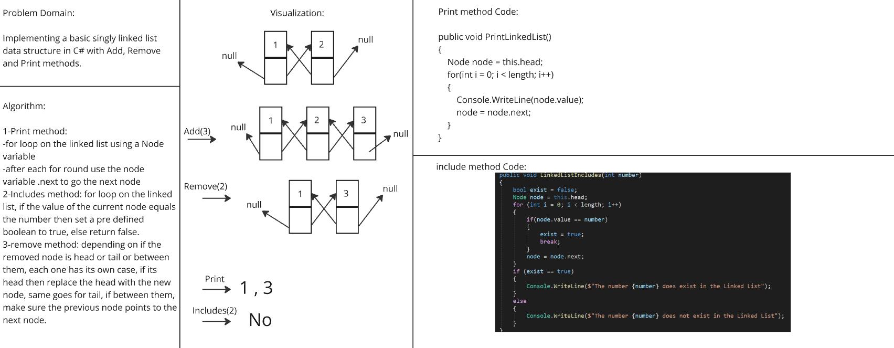
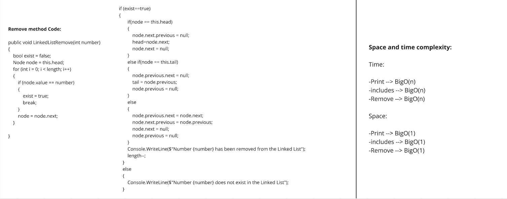
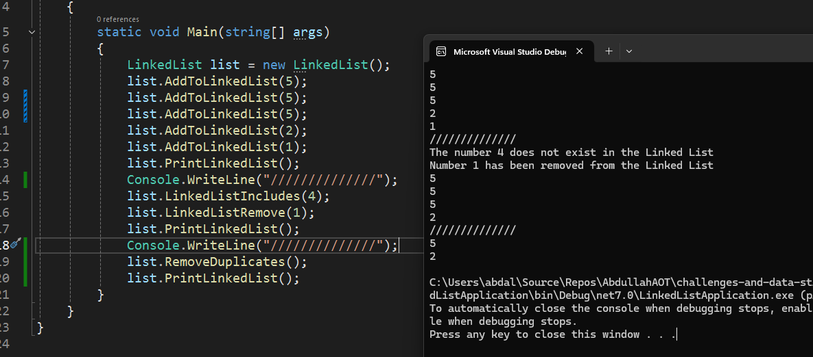
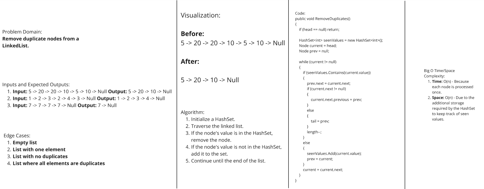
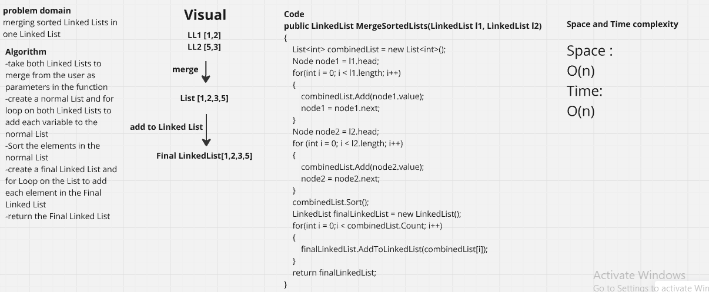

# Linked List Implementation
This application has a basic implementation of Linked List and has some methods
like Add, Print, Remove, and Includes.

Example input/output on console:

Whiteboard:

Example input/output on console for RemoveDuplicates Method:

Whiteboard for RemoveDuplicates Method:

Example input/output on console for Merge Sorted Linked Lists Method:

Whiteboard for RemoveDuplicates Method:
