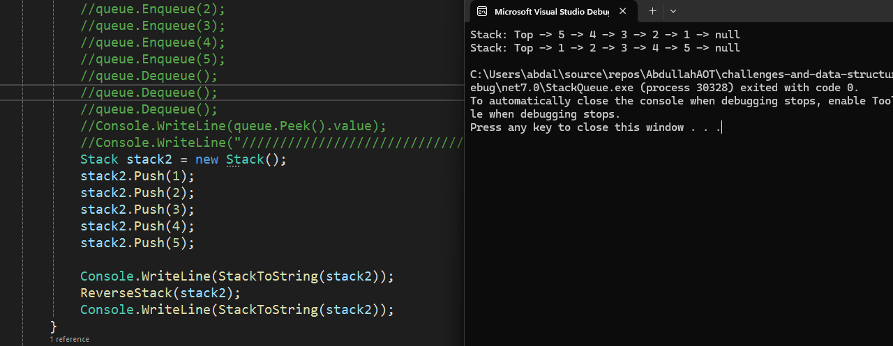
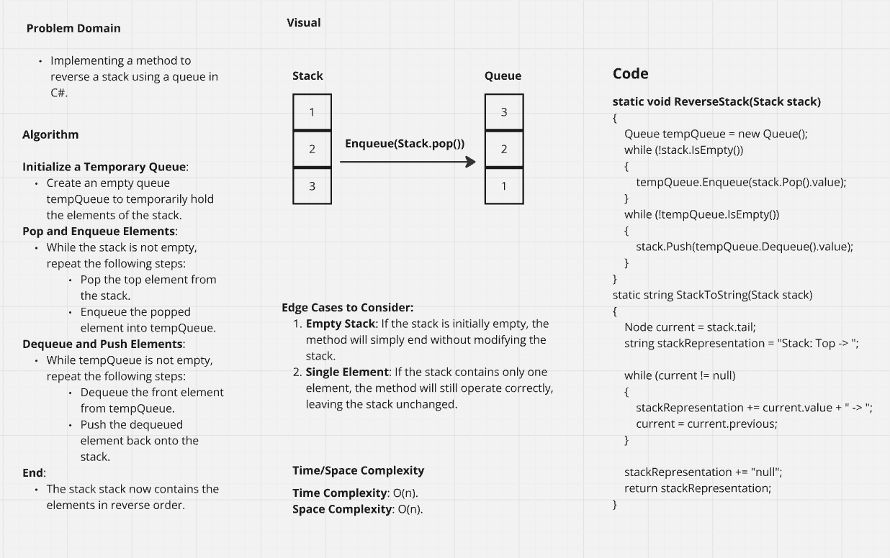
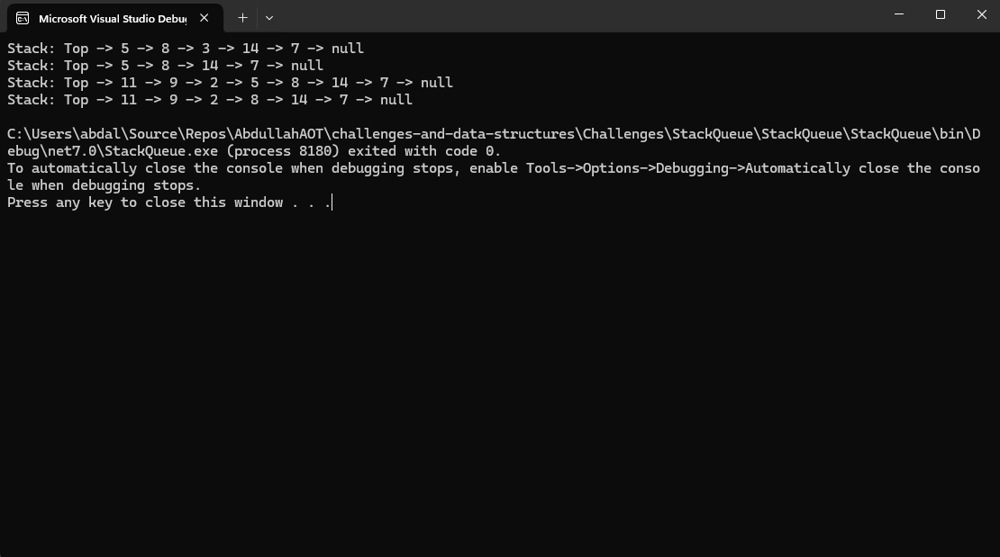
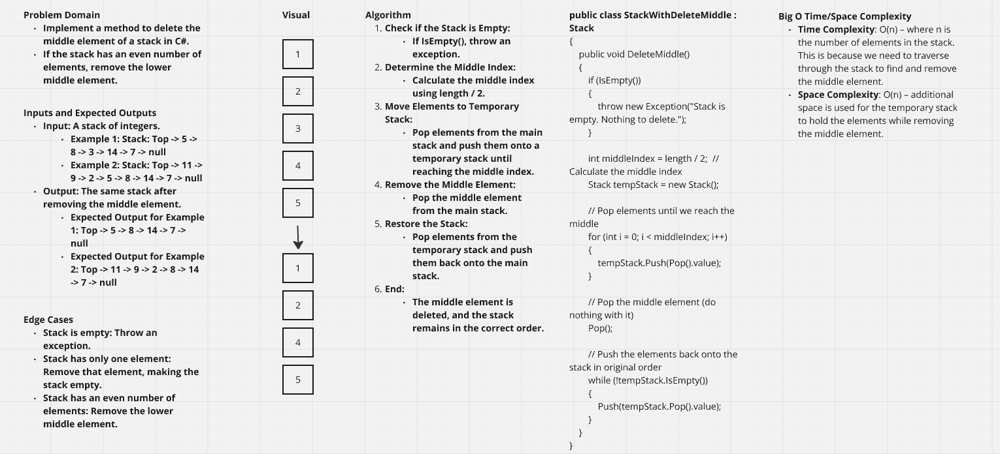
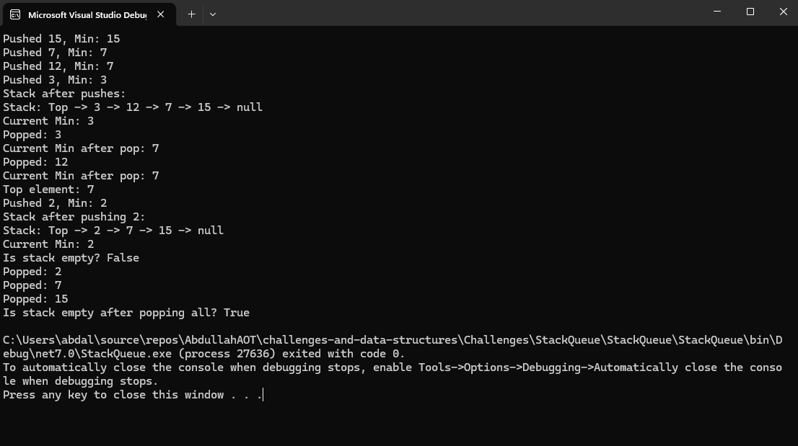
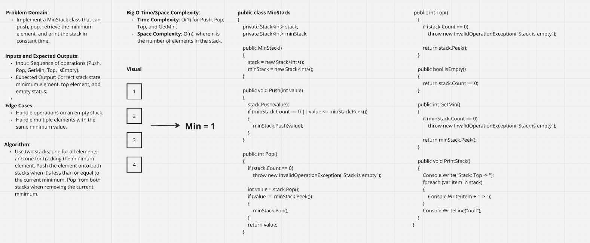

# Stack & Queue Implementation
This application has a basic implementation of Stack and Queue and has the
basic methods for each data structure.

Example input/output on console:

Whiteboard:

# ReverseStackUsingQueue

Example input/output on console:

Whiteboard:

# Stack Delete Middle Value

Example input/output on console:

Whiteboard:

# Stack Minimum value

Example input/output on console:

Whiteboard:
