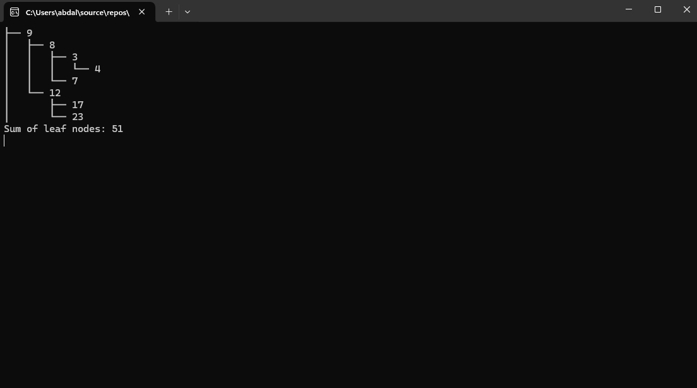
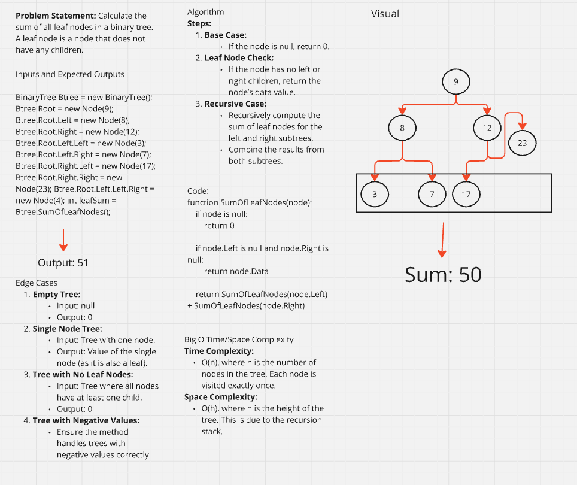
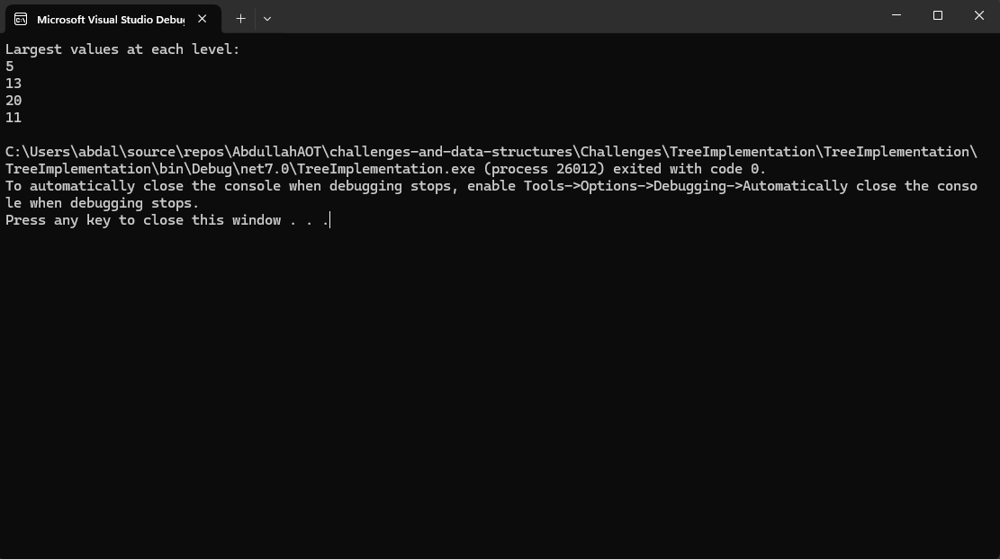
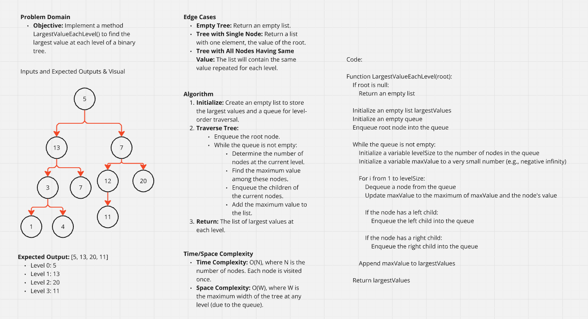
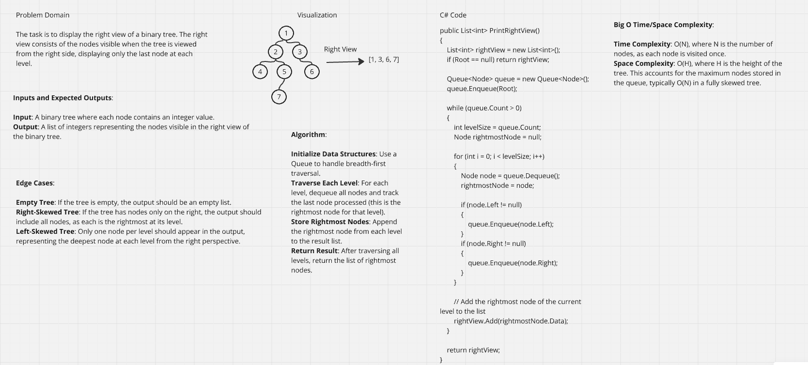

# Tree Implementation
This application has a basic implementation of Binary tree and binary search tree

Whiteboard:

# Mirror Tree Implementation

Console:

Whiteboard:

# Tree Second Max Value Implementation

Console:

Whiteboard:

# Tree Leafs Sum Implementation

Console:

Whiteboard:

# Tree Largest Level Implementation

Console:

Whiteboard:

# Tree RightView

Whiteboard:
