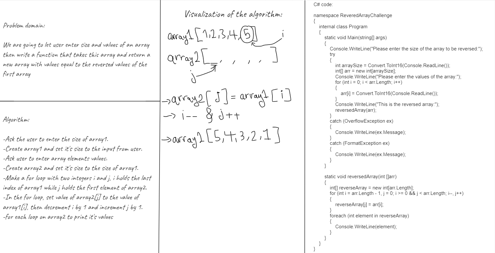
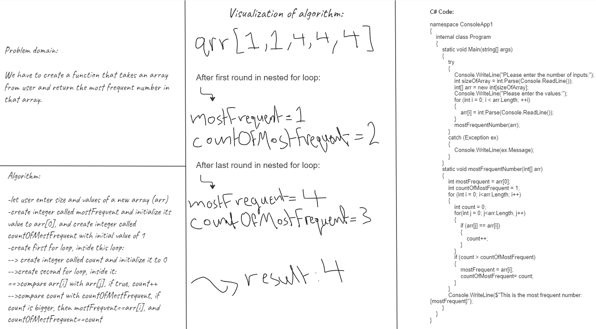
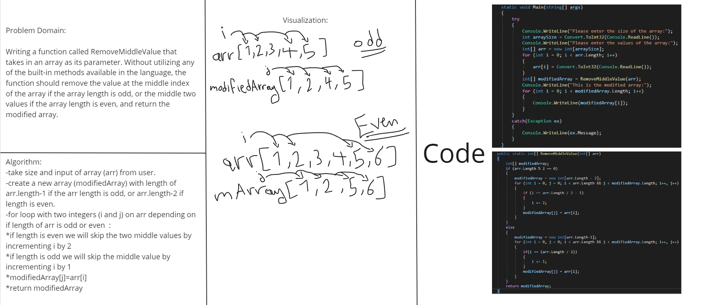
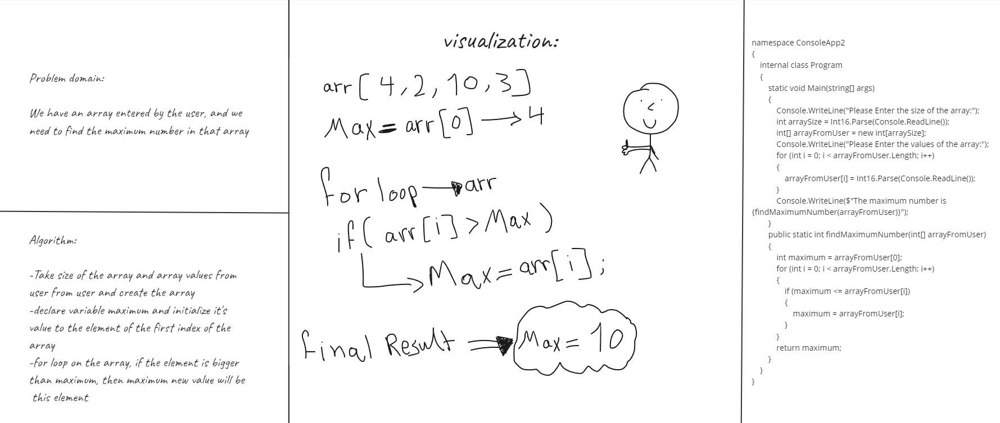

# Reversed Array Challenge
this code will take input from user(size of the array and values of the array), 
then print the reversed values of that array.

# Most Frequent Number Challenge
this code will take input from user(size of the array and values of the array), 
then print the most frequent value in the array.

# Remove Middle Value Challenge
this code will remove the middle value in an array if the array length was odd,
and remove the two middle values if the array length was even.

# Maximum Value Challenge
this code will take input from user(size of the array and values of the array),
and print the maximum number in that array.

